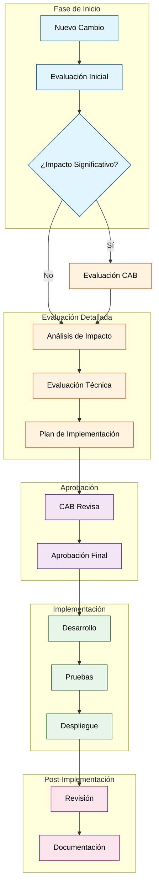
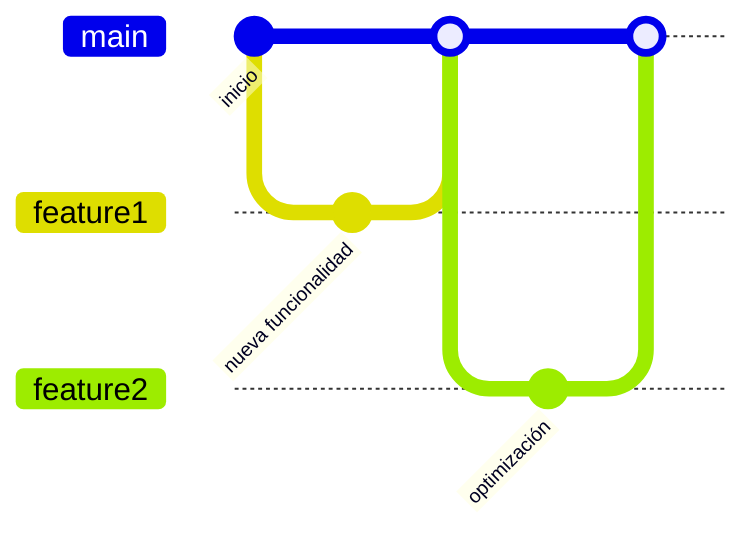

# Git
## Gestionar los cambios en el software
Esta es la principal responsabilidad porque los desarrolladores profesionales tienen un rol fundamental en la gestión de cambios, que va más allá de simplemente escribir código o optimizar rendimiento.

###  Roles y Responsabilidades Principales

1. **Gestión de Cambios**  - Implementación de soluciones de software
  - Corrección de errores
  - Implementación de mejoras en el código existente
  - Creación de nuevas funcionalidades 1:5

2. **Colaboración y Comunicación**  - Trabajo en equipo con otros miembros del equipo de desarrollo
  - Coordinación con diseñadores, analistas y gerentes de proyecto
  - Comunicación efectiva con el equipo técnico y usuarios 2:3

Como muestra el diagrama, el proceso de gestión de cambios está dividido en cinco fases principales (representadas por diferentes colores):

- Fase de Inicio (azul): Identificación y evaluación inicial del cambio
- Evaluación Detallada (naranja): Análisis técnico y planificación
- Aprobación (morado): Revisión por el CAB y aprobación final
- Implementación (verde): Desarrollo, pruebas y despliegue
- Post-Implementación (rosa): Revisión y documentación

###  Por qué esto demuestra que la gestión de cambios es la principal responsabilidad

1. **Participación Integral**  
    - Los desarrolladores participan activamente en todas las fases del proceso
    - Son responsables de la implementación técnica y las pruebas
    - Colaboran con otros equipos durante todo el ciclo de vida del cambio

2. **Enfoque Holístico**  
    - La gestión de cambios requiere considerar múltiples aspectos:
        - Impacto técnico
        - Riesgos potenciales
        - Planificación de implementación
        - Comunicación con stakeholders

## Definición de Software

###  Orígenes Históricos

La comparación del software como algo "blando" tiene sus raíces en la década de 1960, cuando se buscaba distinguirlo claramente del hardware físico. Esta analogía surgió debido a que, mientras el hardware era rígido y difícil de modificar una vez construido, el software presentaba una notable flexibilidad para ser modificado y mejorado.

###  Características Clave

1. **Flexibilidad de Modificación**  - Capacidad de realizar cambios sin afectar la infraestructura física
  - Posibilidad de actualizar funcionalidades sin alterar el hardware
  - Facilidad para corregir errores y agregar nuevas características 1:5

2. **Proceso de Desarrollo**  - Iteraciones continuas de mejora
  - Capacidad de adaptarse a requisitos cambiantes
  - Facilidad para refactorizar y optimizar el código existente

###  Implicaciones Prácticas

La naturaleza "blanda" del software tiene importantes implicaciones para su desarrollo y mantenimiento:

- Permite una evolución continua del producto
- Facilita la adaptación a nuevas tecnologías
- Hace posible corregir errores sin necesidad de reemplazar componentes físicos
- Permite optimizar el rendimiento y agregar funcionalidades según las necesidades del usuario

Esta característica de ser "blando" y fácilmente modificable ha sido fundamental para el éxito del software moderno, permitiendo su evolución constante y adaptación a las cambiantes necesidades tecnológicas y empresariales.

## Repositorios

Un repositorio en el contexto de control de versiones es un almacenamiento centralizado que mantiene un registro completo de todas las modificaciones realizadas en un proyecto a lo largo del tiempo.

### Componentes Fundamentales

1. **Historial Completo**  
    - Registro cronológico de todos los cambios
    - Identificación única de cada modificación
    - Rastreo de quién realizó cada cambio
    - Momento exacto de cada modificación

2. **Estructura del Repositorio**  
    - Árbol jerárquico de archivos y directorios
    - Metadatos de control de versiones
    - Referencias a commits y ramas
    - Configuraciones del proyecto

El diagrama anterior ilustra un flujo de trabajo típico en un repositorio, donde podemos observar:

- La línea principal (main) representa la historia principal del proyecto
- Las ramas laterales (feature1 y feature2) muestran desarrollos paralelos
- Los commits registran cada cambio significativo
- Los merges unen las nuevas funcionalidades con la historia principal

###  Operaciones Principales

1. **Control de Versiones**  
    - Registro de cambios en el código fuente
    - Seguimiento de modificaciones en archivos y directorios
    - Mantenimiento de diferentes versiones del proyecto

2. **Colaboración**  
    - Permite que múltiples desarrolladores trabajen simultáneamente
    - Resuelve conflictos entre cambios concurrentes
    - Facilita la integración de contribuciones

###  Beneficios del Control de Historial

1. **Seguridad y Auditoría**  
    - Registro permanente de todas las modificaciones
    - Capacidad de revertir cambios si es necesario
    - Rastreo de responsabilidades y cambios

2. **Colaboración Efectiva**  
    - Mejora la coordinación entre equipos
    - Reduce conflictos en el desarrollo
    - Facilita la gestión de diferentes versiones

Un repositorio moderno como Git mantiene este historial completo, permitiendo a los desarrolladores trabajar de manera organizada y segura, con la capacidad de rastrear y gestionar todos los cambios realizados en el proyecto a lo largo del tiempo.

## El creador de Git
Git fue creado por Linus Torvalds en 2005, quien es mejor conocido como el creador del kernel de Linux.

###  Contexto Histórico

Git surgió como respuesta a una necesidad específica en el desarrollo de Linux. Anteriormente, el proyecto Linux utilizaba un sistema de control de versiones llamado BitKeeper, pero cuando este dejó de ser gratuito, la comunidad necesitó una alternativa.

###  Desarrollo de Git

Linus Torvalds comenzó a desarrollar Git en abril de 2005, y en solo seis meses logró crear un sistema que superaría en funcionalidad a muchos de sus contemporáneos. Junto con otros desarrolladores, especialmente Junio Hamano, quien se convertiría en el maintainer principal después de Torvalds, crearon un sistema que revolucionaría la forma en que los desarrolladores colaboran en proyectos de software.

###  Características Innovadoras

Git introdujo varias características revolucionarias que lo distinguieron de otros sistemas de control de versiones:

- Sistema distribuido verdadero
- Velocidad excepcional en operaciones
- Eficiencia en el manejo de grandes proyectos
- Robustez en la gestión de ramas y merges

###  Legado de Git

La creación de Git por Linus Torvalds ha tenido un impacto duradero en la industria del software:

- Se ha convertido en el estándar de facto para el desarrollo de software
- Facilitó la colaboración global en proyectos de código abierto
- Revolucionó la forma en que los equipos trabajan en proyectos de software
- Permitió escalar el desarrollo de Linux y otros proyectos grandes de manera eficiente

La creación de Git por Linus Torvalds no solo resolvió un problema inmediato para el desarrollo de Linux, sino que también sentó las bases para una nueva era en la colaboración de software, transformando fundamentalmente cómo los desarrolladores trabajan juntos en proyectos de cualquier escala.

## ¿Qué almacena Git?

Git es un sistema de control de versiones que mantiene un registro completo y detallado de toda la evolución del proyecto, incluyendo metadatos importantes sobre cada modificación.

###  Tipos de Información Almacenada

1. **Datos del Commit**  
    - Mensaje descriptivo del cambio
    - Timestamp exacto de la modificación
    - Identificador único (hash) del commit
    - Referencias a commits padre

2. **Metadatos del Desarrollador**  
    - Nombre del autor
    - Correo electrónico del contribuyente
    - Fecha y hora de la modificación
    - Rama donde se realizó el cambio

3. **Información del Proyecto**  
    - Estado completo del código fuente
    - Estructura de directorios
    - Configuraciones del proyecto
    - Referencias a ramas y etiquetas

El diagrama anterior muestra un ejemplo práctico de cómo Git almacena la información:

- La línea principal (main) representa la historia principal del proyecto
- Las ramas laterales (feature1 y feature2) muestran desarrollos paralelos
- Cada commit registra un cambio específico con su metadata
- Los merges unen las diferentes líneas de desarrollo

###  Beneficios de este Almacenamiento

1. **Seguridad y Auditoría**  
    - Registro permanente de todas las modificaciones
    - Capacidad de rastrear responsabilidades
    - Auditoría completa del historial del proyecto

2. **Colaboración Efectiva**  
    - Mejora la coordinación entre equipos
    - Reduce conflictos en el desarrollo
    - Facilita la gestión de diferentes versiones

3. **Mantenibilidad**  
    - Permite identificar causas raíz de problemas
    - Facilita la reversión de cambios problemáticos
    - Mantiene un registro organizado de la evolución del proyecto

Esta estructura de almacenamiento hace que Git sea una herramienta poderosa para el desarrollo colaborativo de software, permitiendo no solo guardar código sino también mantener un registro completo y detallado de su evolución a lo largo del tiempo.

## Cuestionario

### Pregunta 1:

¿Cuál es la principal responsabilidad de los desarrolladores de software profesionales?

    ⬜ Escribir la mayor cantidad de código posible
    ✅ Gestionar los cambios en el software
    ⬜ Optimizar el rendimiento del software

Las otras opciones son incorrectas porque:

- Escribir la mayor cantidad de código posible es una métrica inapropiada que puede llevar a código de baja calidad
- Optimizar el rendimiento es importante pero es solo un aspecto específico de la gestión de cambios

La gestión efectiva de cambios asegura que el software evolucione de manera controlada y segura, manteniendo su calidad y satisfaciendo las necesidades de los usuarios.

### Pregunta 2:

¿Por qué se compara el software con algo "blando"?

    ⬜ Porque es fácil de romper
    ✅ Porque es fácil de cambiar
    ⬜ Porque es barato de producir
    ⬜ Porque es intangible

La respuesta correcta es "Porque es fácil de cambiar". Esta comparación histórica refleja una característica fundamental del software: su flexibilidad inherente para modificarlo y adaptarlo según las necesidades cambiantes.

Las otras opciones son incorrectas porque:

- "Fácil de romper": Esta caracterización es engañosa, ya que el software moderno está diseñado con mecanismos robustos de validación y pruebas que previenen fallos
- "Barato de producir": Si bien el costo inicial puede ser menor que el hardware, el desarrollo y mantenimiento continuo requiere significativos recursos humanos y tecnológicos
- "Intangible": Aunque es cierto que el software es intangible, esta característica no explica por qué se compara específicamente con algo "blando"

### Pregunta 3:

¿Qué significa el término "repositorio" en el contexto de un sistema de control de versiones?

    ⬜ Un lugar para ejecutar el software
    ⬜ Un lugar para guardar el código fuente
    ✅ Un lugar para guardar la historia de los cambios de un proyecto

Las otras opciones son incorrectas porque:

- "Un lugar para ejecutar el software":
    - El repositorio almacena el código fuente, no es un entorno de ejecución
    - La ejecución del software ocurre en el ambiente de desarrollo o producción
    - El repositorio se centra en el almacenamiento y control de versiones

- "Un lugar para guardar el código fuente":
    - Aunque es cierto que el repositorio almacena código fuente, esta definición es incompleta
    - No menciona el aspecto crucial del historial de cambios
    - Ignora la función de seguimiento y control de versiones

### Pregunta 4:

¿Quién creó Git?

    ⬜ Microsoft
    ⬜ Google
    ✅ Linus Torvalds
    ⬜ Elon Musk

Las otras opciones son incorrectas porque:

- Microsoft: Aunque Microsoft ha sido un importante contribuyente y adoptante de Git, no fue su creador. De hecho, Microsoft más tarde adquirió GitHub, la plataforma más popular para alojar repositorios Git.
- Google: Google desarrolló su propio sistema de control de versiones llamado Piper, pero no creó Git.
- Elon Musk: Aunque es una figura destacada en el mundo tecnológico, Elon Musk no está relacionado con la creación de Git. Sus contribuciones se han centrado principalmente en SpaceX y Tesla.

### Pregunta 5:

¿Qué tipo de información se almacena en Git?

    ⬜ La versión actual del código fuente
    ✅ La historia de los cambios, quién los hizo, cuándo y por qué
    ⬜ Los comentarios del código fuente
    ⬜ Información sobre el hardware del usuario

Las otras opciones son incorrectas porque:

1. "La versión actual del código fuente":
    - Git mantiene todas las versiones, no solo la actual
    - Almacena el historial completo para poder revertir cambios si es necesario
    - La versión actual es solo una parte de toda la información almacenada

2. "Los comentarios del código fuente":
    - Los comentarios son parte del código mismo, no metadatos de Git
    - Git los trata como contenido regular del archivo
    - No hay almacenamiento especial para los comentarios

3. "Información sobre el hardware del usuario":
    - Git es un sistema distribuido que funciona independientemente del hardware
    - No mantiene registros de la configuración física
    - Se centra en el código y sus modificaciones, no en el entorno de ejecución